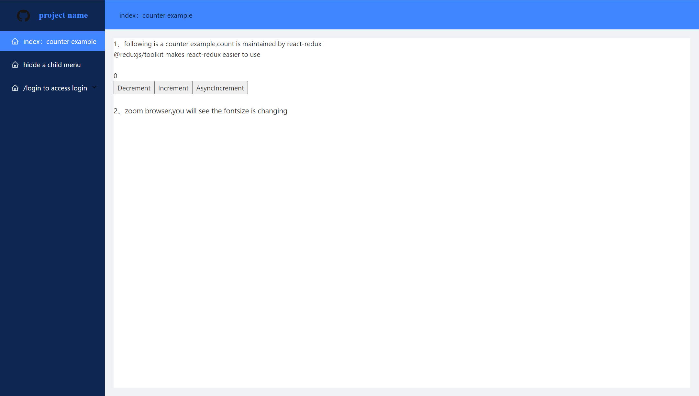

<!-- @format -->

# Thie is a react web boilerplate project

## How do we get started?

fork this project,yarn && yarn start,we are ready

## contains these following important packages

#### webpack5

#### react18

#### react-router6

#### react-redux

#### antd4

#### axios
